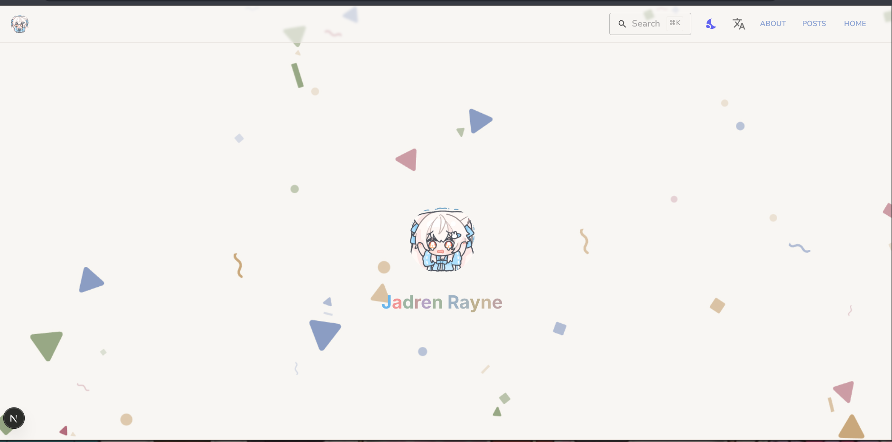
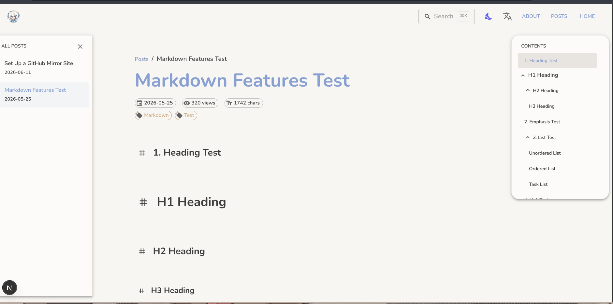
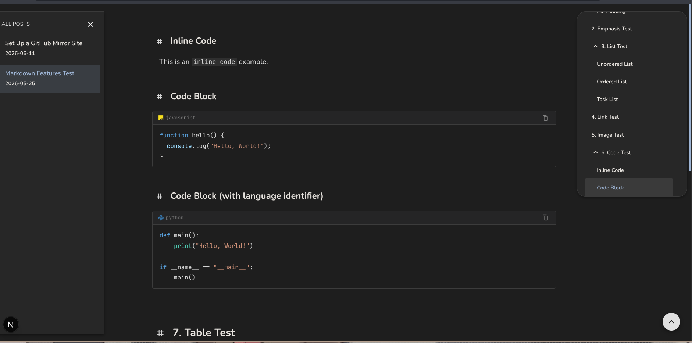

> 📖 [中文文档](docs/getting-start-zh_CN.md)

## A blog/simple documentation site built in spare time

### To see the project in action, visit:
- [rayou's blog](https://blog.rayou.me)


## Submitting or Changing Articles

Please create or modify articles in the following format and submit to the **master** branch.

### Article Format

Create a `.md` file under `content/posts/en/` (English) or `content/posts/zh/` (Chinese) with the following frontmatter:

```markdown
---
title: Your Article Title
date: 2026-06-16T00:00:00.000Z
description: Article description — leave blank to auto-use the title
tags: [tag1, tag2]
---

Write your article content here (Markdown format)...
```

- `title` — Article title
- `date` — Publish date (ISO format); if left empty, the first-accessed date will be used
- `description` — Article summary (optional); if left empty, the title becomes the description
- `tags` — Article tags (optional)

Changes will be merged into the `run` branch and deployed to the server.

## Using This Project as Your Own Blog or Documentation Site

### Preview







### Step 1: Clone, Install & Run

> Since this project uses bun's built-in `bun:sqlite`, you must use [Bun](https://bun.sh/) (a performance-focused Node.js runtime & package manager) to run it. It's recommended to use the `--bun` flag. All examples below use the `--bun` flag.

```shell
# Clone the project
git clone https://github.com/jadrens/dra_blog.git
```

> If you have trouble connecting to GitHub from mainland China, you can use the mirror site I set up (github.rayou.me — **do NOT log in** for your account's safety). See [Setting up a GitHub Mirror](https://blog.rayou.me/blog/zh/github-mirror) for details.<br>
> Use: `git clone https://github.rayou.me/jadrens/dra_blog.git`

```shell
# Make sure Bun is installed
# Navigate and install dependencies
cd dra_blog
bun install
```

```shell
# Start dev server
bun --bun dev
```

Open **http://localhost:3000** to test.

## Step 2: Configuration

- Modify `src/var/config.ts`:

```typescript
export const SITE_CONFIG = {
  // Your site domain — used to generate sitemap.xml for search engine indexing
  baseUrl: "https://blog.rayou.me",
  // Site title
  siteName: "rayoumeu blog",
  // Site description for search engines
  description: "A blog with markdown and LaTeX support",
  // If your site is open source, put your GitHub repo URL here
  githubRepo: "https://github.com/jadrens/drablog",
  githubBranch: "master",
  // Show GitHub icon in footer
  githubClipEnabled: true,
  // Enable GitHub edit button
  githubEditEnabled: true,
} as const;
```

- Change icons:
  Replace `public/avatar.png` — the homepage avatar<br>
  Replace `src/app/icon.png` — the favicon

- Update contact info:
  Modify `src/var/contact.ts` to enable/disable contact methods and update URLs:

```typescript
export const CONTACT_CONFIG = {
  github: {
    enabled: true,                              // Enable or disable
    url: "https://github.com/jadrens",          // Your GitHub profile
    username: "jadrens",
    color: "#181717",
  },
  youtube: {
    enabled: true,
    url: "https://www.youtube.com/@LoongRens",
    username: "@LoongRens",
    color: "#FF0000",
  },
  bilibili: {
    enabled: true,
    url: "https://space.bilibili.com/435996008",
    username: "dragonren",
    color: "#00A1D6",
  },
  telegram: {
    enabled: true,
    url: "https://t.me/dragonrens",
    username: "@dragonrens",
    color: "#26A5E4",
  },
  email: {
    enabled: true,
    address: "jaden@jadren.moe",
  },
  ...
} as const;
```

Set `enabled` to `false` to hide the corresponding contact method.

- Add your pages:
  - **About page** — Edit `content/about/en.md` and `content/about/zh.md` (English & Chinese)
  - **Articles** — Follow the format above and add markdown files under `content/posts/en/...` (English) and `content/posts/zh/...` (Chinese). If the date is left empty, the first-accessed date becomes the article date. If the description is left empty, the title becomes the description.

## Step 3: Deployment

```shell
# Build
bun --bun run build
# Run
bun --bun run start -p 3000
```

- The app runs on port 3000 by default. Change the `-p` value to use a different port. TLS is not supported — use a reverse proxy like Nginx.

### Optional: Manage with systemd

```ini
# /etc/systemd/system/blog.service
[Unit]
Description=Blog Service
After=network.target

[Service]
Type=simple
User=your-user
WorkingDirectory=/path/to/dra_blog
ExecStart=/usr/bin/bun --bun run start -p 3000
Restart=on-failure

[Install]
WantedBy=multi-user.target
```

```shell
# Enable and start the service
sudo systemctl enable --now blog.service
```

## About robots.txt & sitemap.xml

### robots.txt

All crawlers are allowed by default. Modify the `rules` in `src/app/robots.ts` to change this:

```typescript
// src/app/robots.ts
import { MetadataRoute } from "next";
import { SITE_CONFIG } from "@/var/config";

export default function robots(): MetadataRoute.Robots {
  return {
    rules: {
      userAgent: "*",     // Allow all crawlers
      allow: "/",          // Allow all paths
      // disallow: "/admin/",  // Disallow certain paths
    },
    sitemap: `${SITE_CONFIG.baseUrl}/sitemap.xml`,
  };
}
```

### sitemap.xml

All pages are indexed based on `SITE_CONFIG` in `src/var/config.ts`, including:

- **Homepage** — `baseUrl`
- **About page** — `baseUrl/about`
- **Blog listing** — `baseUrl/blog/{locale}`
- **Blog articles** — `baseUrl/blog/{locale}/{slug}`

To modify the sitemap generation logic, edit `src/app/sitemap.ts`:

```typescript
// src/app/sitemap.ts
import { MetadataRoute } from "next";
import { getAllPosts, Locale } from "@/lib/posts";
import { SITE_CONFIG } from "@/var/config";

const locales: Locale[] = ["en", "zh"];

export default function sitemap(): MetadataRoute.Sitemap {
  const allPages: MetadataRoute.Sitemap = [
    {
      url: SITE_CONFIG.baseUrl,
      lastModified: new Date().toISOString().split("T")[0],
      changeFrequency: "weekly",
      priority: 1,
    },
    // ... about page, blog listing, blog articles
  ];
  return allPages;
}
```

## License

```
MIT License

Copyright (c) 2026 Jadrens

Permission is hereby granted, free of charge, to any person obtaining a copy
of this software and associated documentation files (the "Software"), to deal
in the Software without restriction, including without limitation the rights
to use, copy, modify, merge, publish, distribute, sublicense, and/or sell
copies of the Software, and to permit persons to whom the Software is
furnished to do so, subject to the following conditions:

The above copyright notice and this permission notice shall be included in all
copies or substantial portions of the Software.

THE SOFTWARE IS PROVIDED "AS IS", WITHOUT WARRANTY OF ANY KIND, EXPRESS OR
IMPLIED, INCLUDING BUT NOT LIMITED TO THE WARRANTIES OF MERCHANTABILITY,
FITNESS FOR A PARTICULAR PURPOSE AND NONINFRINGEMENT. IN NO EVENT SHALL THE
AUTHORS OR COPYRIGHT HOLDERS BE LIABLE FOR ANY CLAIM, DAMAGES OR OTHER
LIABILITY, WHETHER IN AN ACTION OF CONTRACT, TORT OR OTHERWISE, ARISING FROM,
OUT OF OR IN CONNECTION WITH THE SOFTWARE OR THE USE OR OTHER DEALINGS IN THE
SOFTWARE.
```
